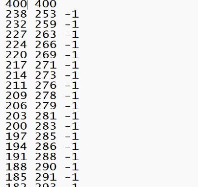
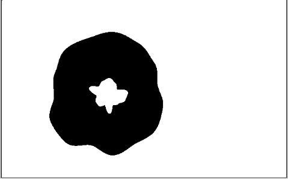

# Image Maniuplation Using Heap, Quad Tree and Hashing

## Features of the Code

- **RLC Encoding**
- **RLC Decoding**
- **Identify Black and White pixels through RLC**
- **Convert to Negative Image**
- **Create an Image Database using Hashing and Search for Images**
- **Image Compression using Quad Tree (Region Compression)**
- **Pre-Order Compression**
- **Post-Order Compression**

## Methods Used

1. Created an Image class.
2. Implemented file reading for PGM files.
3. Built a Hashing-based Database.
4. Implemented the RLC Algorithm.
5. Used a Queue to Find Connected Components.

## Important Instructions

To begin using this program, you must provide the path to the PGM file manually.

## How to Use the Program

1. **Provide the file path manually**: After specifying the file, run the program. A menu will be displayed.
2. If you enter **1**, a submenu will appear offering RLC Encoding, Decoding the image, and converting it to Negative.
3. If you enter **2**, you can use the Hashing Database to search for images.
4. If you enter **3**, you can perform Quad Tree compression, and print Pre-Order and Post-Order for the PGM file.
5. If you enter **4**, the program will terminate.

---

# Image Class Operations

In Question 4, I was asked to create an Image class to perform the following operations:

- Convert an image to **RLC Encoding** and save it as text.
- **Decode** an image from RLC text back to PGM format.
- Find the **Average Black Pixels** in RLC.
- Convert an **RLC Image to Negative**.

I began by using a matrix of 1s and 0s. It didn’t take long to solve the problem in smaller matrices, as debugging helped me identify and fix issues quickly. I then implemented the solution using a **singly linked list** because traversing only through columns sufficed for this problem, without needing to check previous nodes.

### Outputs:

1. **RLC Encoding:**
   

2. **Decoded PGM Image:**
   

3. **RLC to Negative:**
   

---

# Image Database using Hashing

I created a database of images, saving their filenames using hashing. The provided algorithm calculates the hash by:

- Counting black pixels in each row and column.
- Grouping them by 4, summing, and modding by the size of the hash table.

To search for an image, the same hashing function is applied to compute the index. The image is then searched in that index by its filename.

To handle collisions, I used a **Singly Linked List**, which made the code more efficient and easier to manage.

- **Table Size:** 23
- **Images Read:** 30

---

#Quad Tree Compression

This is significantly challenged my coding skills. Initially, I thought it would be straightforward—just traversing block by block—but after doing some research, none of my implementations worked. I revisited my basics of trees and recursion and studied the Quad Tree algorithm through videos and dry runs on paper.

The key solution lay in correctly handling the **grid size** and **width of the image**. By adjusting matrix sizes during each recursive call and using the **right shift operator** to modify width after each iteration, I managed to solve the problem.

To print the **Pre-order** and **Post-order**, I used the recursion method for binary trees.

- **Image Size Used:** 264 x 264

### Post-Order of Quad Tree:

### Pre-Order of Quad Tree:

---

# Happy Coding :)
